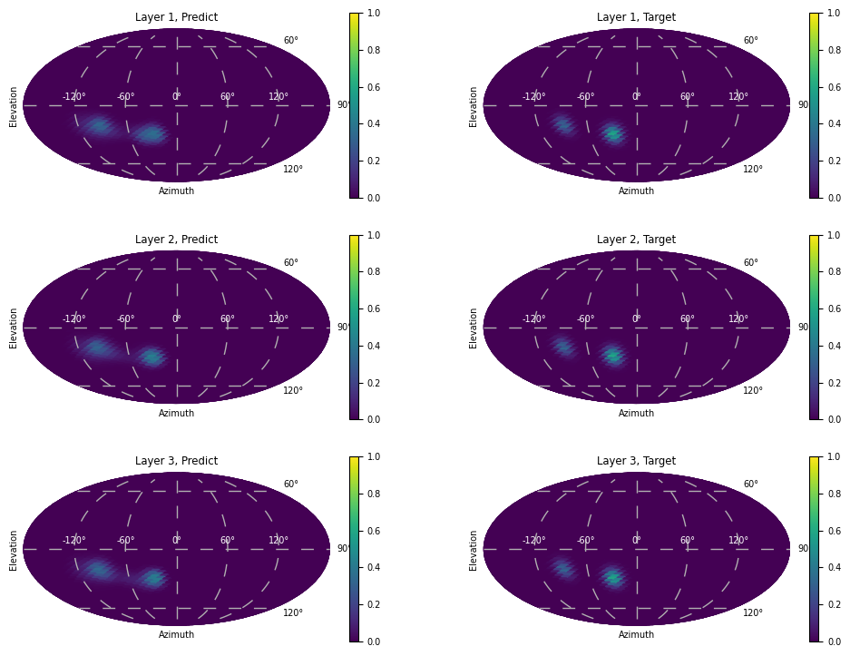

<!-- Under review. -->

# Audio-Geometry-Grid Representation Learning 

This repository contains the model code and pretrained weights for "_Physics-Informed Audio-Geometry-Grid Representation Learning for Universal Sound Source Localization_" [[1]](#reference-1).


Overall architecture of Audio-Geometry-Grid Representation Learning (AGG-RL) frame work with learnable non-uniform discrete Fourier transform (LNuDFT) layer and relative microphone positional encoding (rMPE).\
AGG-RL enables universal sound source localization that generalizes to unseen microphone array geometries and customizable spherical grids.


## Running the Code

You can infer the code by

```sh
python inference.py
``` 

## Examples


Example with 13 channels and 1 speaker.



Example with 4 channels and 2 speakers.

## References
<a name="reference-1"></a>
[1] Min-Sang Baek, Gyeong-Su Kim, Donghyun Kim and Joon-Hyuk Chang "Physics-Informed Audio-Geometry-Grid Representation Learning for Universal Sound Source Localization," in _Proc. International Conference on Learning Representations (ICLR)_, 2026. [[Paper]](https://openreview.net/forum?id=bWXpJFesLS)